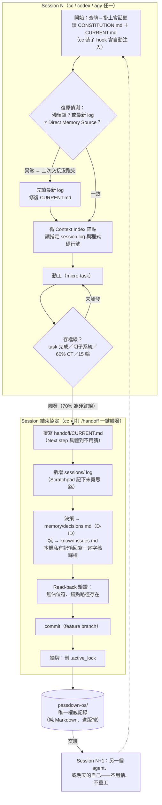

# Passdown OS — 跨 AI Agent 協作框架

> *Passdown*：軍隊與護理界的「交班日誌」——離班的人寫給接班的人，讓下一班不用猜就能接手。

讓 Claude Code / Codex / Antigravity（或任何組合的 AI agent）在同一個專案上無縫接力的**純 Markdown** 框架：管 session 之間怎麼交接、記憶存哪裡、判斷怎麼做。零依賴、無 daemon、無資料庫——整包複製進專案就能用。

*A pure-Markdown, zero-dependency framework for seamless handoffs between AI coding agents (Claude Code / Codex / Antigravity / any). It governs session-to-session handoff protocols, shared memory, context-budget economics, and externalized judgment rubrics — so a cheap model tomorrow inherits the discipline of an expensive model today. Docs are currently in Traditional Chinese.*

## 交接流程一圖看懂

## 導入新專案

**最省事的方式**：把這個範本庫的路徑（或 git URL）丟給你的 AI agent，說一句「照 INSTALL.md 把 passdown-os 裝進這個專案」——[`INSTALL.md`](INSTALL.md) 是寫給 agent 讀的完整安裝程序（複製清單、範本庫狀態的汙染排除、重置、入口檔與 hooks 設定、驗收回報），agent 會全程自己動手。

想手動裝也可以：

1. 把框架本體放進專案根目錄的 `passdown-os/` 資料夾（哪些檔案該搬、哪些不該搬，見 `INSTALL.md` 第 1 步）。
2. 跑 [`GOLDEN_TEMPLATE.md`](GOLDEN_TEMPLATE.md) 的「套用後自檢清單」重置狀態檔。
3. 依 [`entrypoints/README.md`](entrypoints/README.md) 設定各 agent 入口檔；cc / codex / agy 各有 hooks 範本（SessionStart 注入 + 檢查點計數器），見 [`entrypoints/hooks/README.md`](entrypoints/hooks/README.md)。

## 從哪裡開始讀

| 你是誰 | 讀什麼 |
| --- | --- |
| 第一次接觸本專案的人或 AI | [`PROJECT_MANIFEST.md`](PROJECT_MANIFEST.md)（專案 DNA：30 秒掌握定位、版本與入口） |
| 剛接手的 agent（每次 session 開始） | [`CONSTITUTION.md`](CONSTITUTION.md) → [`handoff/CURRENT.md`](handoff/CURRENT.md)，依 Session 開始協定往下 |
| 遇到特定情境（git 衝突、記憶同步、維護） | [`PROTOCOLS.md`](PROTOCOLS.md) 對應章節（被指到才讀） |
| 要交辦任務 / 派 subagent | [`DISPATCH.md`](DISPATCH.md) ＋ [`prompts/`](prompts/README.md) 範本 |
| 對「做不做、停不停、算不算完成」猶豫 | [`RUBRICS.md`](RUBRICS.md) |
| 要把框架複製到新專案的人 | [`GOLDEN_TEMPLATE.md`](GOLDEN_TEMPLATE.md)，入口檔設定見 [`entrypoints/README.md`](entrypoints/README.md) |

完整檔案地圖見 `CONSTITUTION.md` 的「檔案地圖」章節。

## 規則檔的分工

- **CONSTITUTION.md** — session **之間**的核心協定（每次必讀）：交接、context 紅線、task 切分、卡關、誠實條款。
- **PROTOCOLS.md** — 核心協定的細節篇（效力相同，被指到才讀）：Spectra 整合、記憶接力、Git 策略、衝突處理、本機記憶同步、維護規則。
- **DISPATCH.md** — session **之內**：怎麼調度模型與 subagent、交辦、回報、升降級、驗證。cc 的自動化實作見 `entrypoints/claude-agents/`。
- **RUBRICS.md** — 決策點：把「需要判斷力」的時刻寫成可照做的 checklist。
